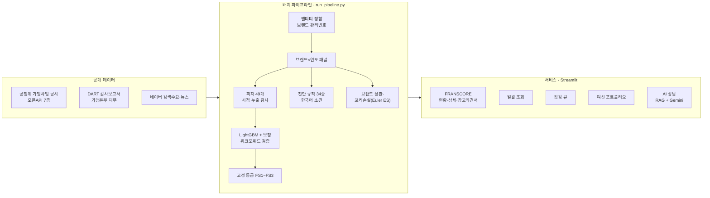

<div align="center">


# 🏦 FranSCORE — 가맹점 여신에 '브랜드' 리스크 축을 더하다

**KB국민은행 제8회 AI Challenge 출품작 · 개인 프로젝트**

은행은 가맹점주를 **차주 단위**로 심사하지만, 부실은 **브랜드 단위로 함께** 옵니다.<br/>
공정위 가맹사업 공시와 가맹본부 감사보고서로 **외식 프랜차이즈 1,521개 브랜드의 1년 내 구조악화 위험**을 산출하고,<br/>
심사 · 사후관리 · 편중 관리 업무 화면으로 연결한 **2선 리스크 관리 서비스**입니다.

<br/>

[](https://kb-franscore.streamlit.app)
[](docs/RESULTS.md)
[](docs/TECHNICAL_REPORT.md)


</div>

---

## 📌 Overview

> **🔍 문제** — 가맹점주 대출은 개인사업자 CB·대안정보(매출·상권·업력·결제정보)로 심사하는데, 이 정보는 모두 **점포 단위**입니다. 같은 브랜드 가맹점들이 함께 무너지는 **브랜드 공통 위험**은 어느 심사 자료에도 없습니다.
>
> **🛠️ 해결** — 공정위 가맹사업 공시(오픈API **7종**)·DART 감사보고서·네이버 검색수요로 브랜드×연도 패널을 만들고, **1년 내 구조악화 확률 → 고정 등급(FS1~FS3) → 근거 소견**을 산출해 업무 화면과 문서로 제공합니다.
>
> **📈 결과** — 2022년 자료로 맞춘 등급을 2023년에 그대로 적용했을 때 실제 악화율이 **안정 2.3% → 관찰 8.8% → 주의 19.5%** 로 갈립니다(시점 밖 검증). 워크포워드 표본 밖 AUC **0.707**.

### 누가, 어느 업무에서 쓰는가

| 여신 업무 | 실무자의 질문 | FranSCORE 가 주는 것 |
|---|---|---|
| **신규 취급** (심사) | "이 가맹점주가 속한 브랜드, 괜찮은가?" | 브랜드 상세 · 품의서용 **참고의견서** · 신청 목록 **일괄 조회** |
| **사후관리** (조기경보) | "올해 무엇부터 점검하나?" | **점검 큐** — 중대 신호 → 1년 내 악화 위험 × 가맹점 수 순서, 담당·메모·엑셀 반출 |
| **포트폴리오** (편중 관리) | "어느 브랜드에 쏠렸고, 꼬리위험은 어디서 오나?" | **여신 포트폴리오** — HHI·브랜드/업종 한도 초과·꼬리손실 기여(Euler ES) |

> 차주 심사를 **대체하지 않습니다.** 차주 심사가 구조적으로 볼 수 없는 **브랜드 축 하나를 더합니다.**
> 등급은 부도확률(PD)이 아니라 브랜드 공시 지표의 구조악화 확률이며, 여신 승인·거절, 한도·금리 결정에 쓰지 않습니다.

---

## 💡 Why brand? — 문제 정의

- **시장이 크고 약하다** — 자영업자 대출 **1,095.5조원**, 숙박·음식업 사업자대출 연체율 **3.02%** 로 부동산업(1.10%)의 약 3배(한국은행 『금융안정보고서』 2025.12). 가맹점 379,739개 · 브랜드 13,725개(공정위, 2025).
- **차주 부도 = 담보 가치 동시 소멸** — 가맹사업법상 가맹점사업자의 파산·부도는 가맹계약 **즉시해지** 사유입니다. 영업권이 함께 사라져 **PD와 LGD가 같이 나빠집니다.**
- **위험이 브랜드에 모인다** — 같은 브랜드 가맹점끼리의 자산상관 **0.416**, 서로 다른 브랜드 사이 **0.005**. 한 브랜드의 모든 지역이 동시에 줄어든 빈도는 지역 독립 가정의 **21.6배**입니다.

<picture>
  <source media="(prefers-color-scheme: dark)" srcset="assets/charts/brand_correlation-dark.png">
  
</picture>

- **그래서 차주를 서로 독립으로 보면 꼬리를 과소평가한다** — 60개 브랜드 · 차주 9,180명 몬테카를로에서 비예상손실(99%)이 **1.7억 → 12.7억, 7.69배** 로 커집니다.

<picture>
  <source media="(prefers-color-scheme: dark)" srcset="assets/charts/tail_loss-dark.png">
  
</picture>

<sub>상관은 지역별 점포 감소의 동시성으로 잰 대리지표이고, 익스포저는 공시 창업비용으로 만든 추정치입니다(실제 여신 잔액은 은행 내부 자료). 절대 금액보다 **독립 가정 대비 배수**가 메시지입니다. → [전체 표와 한계](docs/RESULTS.md)</sub>

---

## 🖥️ Service — 화면

<table>
<tr>
<td width="50%"><br/><b>브랜드 상세</b> — 등급·근거 소견·공시 추이·본부 재무·검색 수요. 참고의견서 내려받기, 공유 링크</td>
<td width="50%"><br/><b>일괄 조회</b> — 신청 목록 업로드 → 브랜드 자동 매칭(통칭·동명 구분) → 등급·중대 신호·확인 서류를 붙여 엑셀 반출</td>
</tr>
<tr>
<td><br/><b>점검 큐</b> — 중대 신호 우선, 1년 내 악화 위험 × 가맹점 수 순서. 담당 배정·처리상태·확인 메모·엑셀 반출</td>
<td><br/><b>참고의견서</b> — 여신 품의서에 첨부하는 인쇄·PDF용 문서. 확인·징구 서류 체크리스트 포함</td>
</tr>
<tr>
<td><br/><b>여신 포트폴리오</b> — 실행·회수를 넣으면 HHI·집중도·대리 예상손실을 즉시 재계산, 한도 초과 경고</td>
<td><br/><b>AI 상담</b> — 자연어 질의에 공시·감사보고서·뉴스 근거로 답변. API 키가 없어도 표 형태로 답합니다</td>
</tr>
</table>

### 실무자가 쓰기 편하도록

- **중대 신호는 등급과 따로 본다** — 본부 계속기업 불확실성·자본잠식·정보공개서 등록취소는 사건 그 자체입니다. 모형 등급이 '안정'이어도 점검 큐 맨 앞에 올립니다.
- **악화가 이미 난 브랜드는 모형 대신 실적으로** — 올해 공시에 악화가 나타난 브랜드는 학습 표본 밖입니다. 확률 대신 **같은 사건 수 브랜드의 다음 해 재발동률**(건전 9.4% · 1건 24.1% · 2건 45.9% · 3건 64.8%)로 판단합니다.
- **모든 숫자에 문장과 출처** — 규칙 34종이 "2024년에 계약이 끝난 가맹점이 82개로, 연초 점포의 58.6%입니다. 한식 업종 상위 8%" 처럼 그 브랜드의 실제 수치로 소견을 씁니다.
- **화면끼리 같은 숫자** — 등급 경계·표시 반올림·점검 순서를 한 모듈(`src/grading.py`)에서 정하고, 화면과 AI 상담이 같은 규칙을 씁니다.
- **공유와 반출** — 브랜드 링크(`?brand=`), 한글 머리글 엑셀, 품의서용 참고의견서.

---

## 📊 Validation — 검증

<picture>
  <source media="(prefers-color-scheme: dark)" srcset="assets/charts/grade_validation-dark.png">
  
</picture>

| 항목 | 결과 |
|---|---|
| 판별력 — 워크포워드 표본 밖 (2021~2023, n=2,063) | AUC **0.707** [0.671, 0.742] · KS **0.316** |
| 순위 성능 — fold 평균 Lift@10% | LightGBM **2.745** · 로지스틱 2.526 · 계약종료율 단일변수 2.403 · 전년 상태 유지 1.688 |
| 보정 — 2023 시점 밖 | Hosmer-Lemeshow p=0.158 · ECE 0.035 |
| 등급 분리 — 2022 → 2023 시점 밖 | 안정 2.3% · 관찰 8.8% · 주의 19.5% |
| 뉴스 사건 추출 — 정답셋 59건 | Gemini 정확도 **0.966** vs 규칙기반 0.475 |

> **정직한 주장 범위** — LightGBM 이 통계적으로 유의하게 넘어서는 것은 '전년 상태 유지' 기준모형뿐이고, 로지스틱·단일변수와는 **통계적으로 동등**합니다. LightGBM 을 쓰는 이유는 성능 우위가 아니라 **SHAP 요인 분해로 브랜드별 근거를 설명**할 수 있어서입니다. 신뢰구간·불리한 결과까지 전부 → [docs/RESULTS.md](docs/RESULTS.md)

**품질 장치** — 시점 누출 자동 검사 · 라벨 규칙 학습 전 동결 · 두 표본 트랙 사전 선언 · 문서에 적힌 수치 **186건**을 산출물과 자동 대조(`tools/check_doc_numbers.py`) · pytest 전 화면 스모크 테스트

---

## 🏗️ Architecture & Pipeline



| 단계 | 핵심 설계 |
|---|---|
| **정합** | 이름이 아니라 공정위 **브랜드·본부 관리번호**로 연도를 잇습니다(이름 매칭은 오매칭이 절반 수준). |
| **라벨** | '악화' = 다음 해 공시 지표(가맹점 순감소·실질매출 감소·계약종료율 급등)가 **업종×연도 하위 구간**에 진입. 규칙은 학습 전에 고정합니다. |
| **검증** | 완전 시간분할 + 워크포워드 3-fold, 기준모형 3종(전년 상태 유지·단일변수·로지스틱)과 같은 지표로 비교합니다. |
| **등급** | 순위가 아닌 **고정 확률 구간**(4.5% · 16.0%) — 업계 전체가 나빠지면 하위 등급이 늘어납니다. |
| **AI** | LLM 은 뉴스 사건 구조화와 상담에만 씁니다. 점수에는 넣지 않고, 정답셋으로 규칙기반과 비교 평가했습니다. |

---

## 🛠️ Tech Stack

| 구분 | 기술 |
|---|---|
| **Data** |    |
| **ML·통계** |     |
| **LLM·검색** |   |
| **App** |   |
| **Quality** |   |
| **Data sources** | 공정거래위원회 가맹사업정보 오픈API · 금융감독원 OPEN DART · 네이버 데이터랩·검색 API |

---

## 🚀 Run Locally

```bash
git clone https://github.com/AISWKimBeomSu/KB_franSCORE.git && cd KB_franSCORE
pip install -r requirements.txt           # Python 3.13 (버전 고정)
streamlit run src/app.py                  # 산출물이 포함돼 있어 API 키 없이 전 화면 동작
```

```bash
python run_pipeline.py --step all         # data/raw 스냅샷으로 전 파이프라인 재실행 (API 키 불필요)
pytest -q                                 # 단위 · 정합성 · 전 화면 스모크 테스트
python tools/check_doc_numbers.py         # 문서에 적힌 수치 ↔ 산출물 대조
python tools/readme_charts.py             # 이 README 의 차트를 산출물에서 다시 그리기
```

<details>
<summary>API 키 (전부 선택 — 없으면 해당 기능만 대체 경로로 동작)</summary>

| 환경변수 | 발급처 | 없을 때 |
|---|---|---|
| `GEMINI_API_KEY` | aistudio.google.com | AI 상담은 수집된 사실을 표로 정리해 답변, 뉴스 추출은 규칙기반 |
| `NAVER_CLIENT_ID` / `_SECRET` | developers.naver.com | 뉴스는 Google News RSS(제목만) |
| `DART_API_KEY` | opendart.fss.or.kr | 본부 재무 재수집 불가 (포함된 산출물은 그대로 사용) |
| `DATA_GO_KR_KEY` | data.go.kr | 공정위 공개 데모키로 대체 |

배포는 [DEPLOY.md](DEPLOY.md) — Streamlit Community Cloud(Python 3.13 지정)·사내망 이식 절차.
</details>

---

## 🗂️ Project Structure

```
KB_franSCORE/
├─ run_pipeline.py          # 파이프라인 러너 (--step collect … diagnose)
├─ config.yaml              # 라벨 임계값·분할·모형·포트폴리오 가정 — 학습 전 고정
├─ src/
│  ├─ collect.py entity.py panel.py         # 공정위 수집 · 관리번호 정합 · 패널
│  ├─ dart.py ifrmp.py naver.py             # 본부 재무(DART) · 정보공개서 · 검색수요/뉴스
│  ├─ features.py labels.py                 # 피처 49개 · 라벨 (시점 누출 검사)
│  ├─ model.py evaluate.py backtest.py      # 학습 · 기준모형 · 보정 · 워크포워드
│  ├─ score.py diagnosis.py grading.py      # 최신 점수 · 진단 규칙 34종 · 등급/순서 규칙
│  ├─ portfolio.py correlation.py           # 집중도 · 브랜드 상관 · 꼬리손실
│  ├─ guidance.py report.py batch.py        # 확인 서류 가이드 · 참고의견서 · 일괄 조회
│  ├─ llm.py news_llm.py rag.py chat.py     # Gemini · 뉴스 사건 추출 · RAG · 상담
│  ├─ app.py theme.py                       # Streamlit 셸 · 디자인 시스템
│  └─ views/                                # 화면 6종
├─ tests/                   # 단위 · 정합성 · 개인정보 · 전 화면 스모크
├─ tools/                   # 문서 수치 대조 · README 차트 · 품질 점검 스크립트
├─ data/raw/ data/processed/ outputs/       # 원본 스냅샷 · 가공 데이터 · 산출물
└─ docs/                    # 검증 결과 · 기술설명서 · 방법론 · 사용 명세 · 운영 설계
```

## 📚 Docs

| 문서 | 내용 |
|---|---|
| [docs/RESULTS.md](docs/RESULTS.md) | 검증 결과 상세 — 전체 표·신뢰구간·불리한 결과·데이터 출처 |
| [docs/TECHNICAL_REPORT.md](docs/TECHNICAL_REPORT.md) | 전 과정 기술설명서 — 문제·데이터·모형·운영, 스스로 잡은 결함 전수 기록 |
| [docs/METHODOLOGY.md](docs/METHODOLOGY.md) | 방법론 공개서 |
| [docs/MODEL_USE_SPEC.md](docs/MODEL_USE_SPEC.md) | 모형 사용 범위·금지 용도 |
| [docs/OPERATIONS.md](docs/OPERATIONS.md) | 운영·거버넌스 설계 (은행 실여신 연결 인터페이스 포함) |
| [docs/LEAKAGE_CHECKLIST.md](docs/LEAKAGE_CHECKLIST.md) | 시점 누출 점검표 |

---

## ⚠️ Limitations

- 라벨은 부도가 아니라 **공시 지표 기반 구조악화 사건**입니다. 브랜드 악화가 개별 차주 부도로 이어지는지는 은행 내부 데이터로 검증해야 합니다.
- 여신 익스포저는 **공시 창업비용 기반 추정치**입니다. 은행 실여신 CSV(`brand_id, exposure`)를 연결하면 같은 화면이 실측 기준으로 바뀝니다.
- 본부 재무는 자격 브랜드 기준 커버리지 13.8%(가맹점 가중 48.1%)이고, 감사의견은 본문 자동 판독이라 **'원문 확인 필요'** 로만 표시합니다.
- 연 1회 공시에 기반한 **연간 브랜드 오버레이**입니다 — 월 단위 차주 조기경보를 대체하지 않고 그 위에 얹습니다.

---

## 👤 Author

**김범수 (Beomsu Kim)** · [@AISWKimBeomSu](https://github.com/AISWKimBeomSu)

문제 정의 · 데이터 수집/정합 파이프라인 · 모형·검증 설계 · 서비스 설계와 구현 — KB국민은행 제8회 AI Challenge 출품
